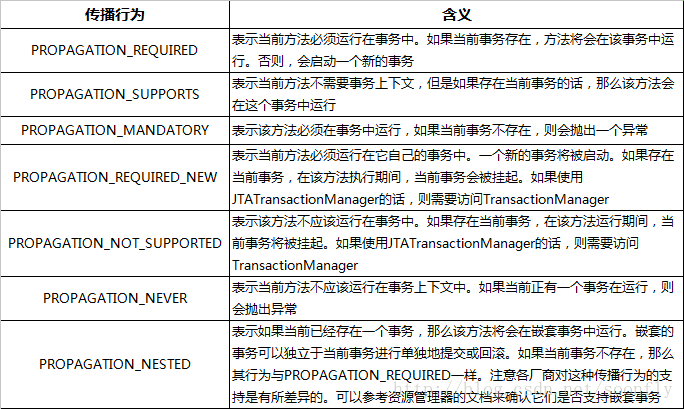
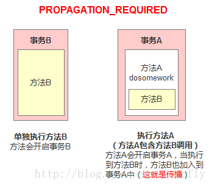
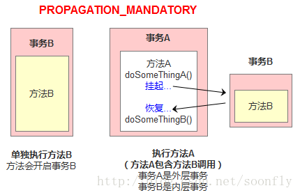

### 事务传播行为
事务传播行为（propagation behavior）指的就是当一个事务方法被另一个事务方法调用时，这个事务方法应该如何进行。
例如：methodA事务方法调用methodB事务方法时，methodB是继续在调用者methodA的事务中运行呢，还是为自己开启一
个新事务运行，这就是由methodB的事务传播行为决定的。

Spring定义了七种传播行为：


### PROPAGATION_REQUIRED
如果存在一个事务，则支持当前事务。如果没有事务则开启一个新的事务。可以把事务想像成一个胶囊，在这个场景下方法B用的是方法A产生的胶囊（事务）。


举例有两个方法：
```
@Transactional(propagation = Propagation.REQUIRED)
public void methodA() {
 methodB();
// do something
}

@Transactional(propagation = Propagation.REQUIRED)
public void methodB() {
    // do something
}
```
单独调用methodB方法时，因为当前上下文不存在事务，所以会开启一个新的事务。
调用methodA方法时，因为当前上下文不存在事务，所以会开启一个新的事务。
当执行到methodB时，methodB发现当前上下文有事务，因此就加入到当前事务中来。

### PROPAGATION_SUPPORTS
如果存在一个事务，支持当前事务。如果没有事务，则非事务的执行。但是对于事务同步的事务管理器，PROPAGATION_SUPPORTS与不使用事务有少许不同。

举例有两个方法：
```
@Transactional(propagation = Propagation.REQUIRED)
public void methodA() {
 methodB();
// do something
}

// 事务属性为SUPPORTS
@Transactional(propagation = Propagation.SUPPORTS)
public void methodB() {
    // do something
}
```
单纯的调用methodB时，methodB方法是非事务的执行的。当调用methdA时,methodB则加入了methodA的事务中,事务地执行。

### PROPAGATION_MANDATORY
如果已经存在一个事务，支持当前事务。如果没有一个活动的事务，则抛出异常。
```
@Transactional(propagation = Propagation.REQUIRED)
public void methodA() {
 methodB();
// do something
}

// 事务属性为MANDATORY
@Transactional(propagation = Propagation.MANDATORY)
public void methodB() {
    // do something
}
```
当单独调用methodB时，因为当前没有一个活动的事务，则会抛出异常throw new IllegalTransactionStateException(“Transaction propagation ‘mandatory’ but no existing transaction found”);
当调用methodA时，methodB则加入到methodA的事务中，事务地执行。


### PROPAGATION_NEW
使用PROPAGATION_REQUIRES_NEW,需要使用 JtaTransactionManager作为事务管理器。
它会开启一个新的事务。如果一个事务已经存在，则先将这个存在的事务挂起。
```
@Transactional(propagation = Propagation.REQUIRED)
public void methodA() {
doSomeThingA();
methodB();
doSomeThingB();
// do something else
}


// 事务属性为REQUIRES_NEW
@Transactional(propagation = Propagation.REQUIRES_NEW)
public void methodB() {
    // do something
}
```
当调用
```
main{  
    methodA();
}
```
相当于调用
```
main(){
    TransactionManager tm = null;
    try{
        //获得一个JTA事务管理器
        tm = getTransactionManager();
        tm.begin();//开启一个新的事务
        Transaction ts1 = tm.getTransaction();
        doSomeThing();
        tm.suspend();//挂起当前事务
        try{
            tm.begin();//重新开启第二个事务
            Transaction ts2 = tm.getTransaction();
            methodB();
            ts2.commit();//提交第二个事务
        } Catch(RunTimeException ex) {
            ts2.rollback();//回滚第二个事务
        } finally {
            //释放资源
        }
        //methodB执行完后，恢复第一个事务
        tm.resume(ts1);
        doSomeThingB();
        ts1.commit();//提交第一个事务
    } catch(RunTimeException ex) {
        ts1.rollback();//回滚第一个事务
    } finally {
        //释放资源
    }
}
```
在这里，我把ts1称为外层事务，ts2称为内层事务。从上面的代码可以看出，ts2与ts1是两个独立的事务，互不相干。Ts2是否成功并不依赖于 ts1。
如果methodA方法在调用methodB方法后的doSomeThingB方法失败了，而methodB方法所做的结果依然被提交。而除了 methodB之外的其它代码导致的结果却被回滚了

https://blog.csdn.net/soonfly/article/details/70305683
https://www.cnblogs.com/alimayun/p/10933289.html